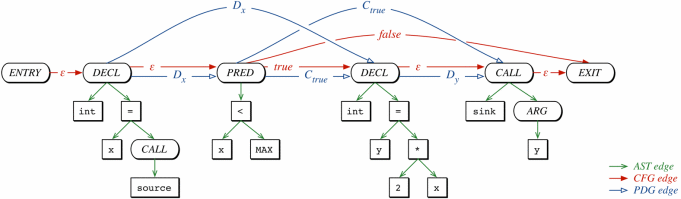

# Slicing Tools

Dieses Repository enthält die Slicing- und Analyse-Tools DG und Joern,
verpackt als Docker-Images. Die Images befinden sich in den Ordnern
`./Docker/DG/` und `./Docker/Joern`. Dort ebenfalls befindlich, ist ein
jeweiliges Shell-Skript, `run.sh`, welches die Docker-Images baut und den
Container ausführt.

Weiterhin befinden sich im Wurzelverzeichnis des Repository, die Ordner
`files` und `examples`. Letzterer beinhaltet einige Minimalbeispiele, um
die Tools zu testen. Als ein komplexeres Beispiel, ist dort ebenfalls
der CPython-Interpreter enthalten, welcher bereits in LLVM-Bitcode
übersetzt wurde. Um die übrigen Beispiele für die Verwendung mit DG in
LLVM-Bitcode zu übersetzen, genügt es `make` im jeweiligen Ordner
auszuführen. Der `files`-Ordner kann genutzt werden, um Dateien zwischen
dem Container und dem Host auszutauschen. Beide Ordner `files` und
`examples` werden in den Container abgebildet.  Im Fall von Joern, sind
diese unter `/joern/files` sowie `/joern/examples` und unter DG direkt
im Wurzelverzeichnis zu finden.


## DG

DG stellt mehrere Programme zur Verfügung, der Kern ist jedoch das
Slicing-Tool `llvm-slicer`, welches die Funktionen aller anderen Tools
beinhaltet. Im Folgenden wird aus diesem Grund stets `llvm-slicer`
verwendet. Die Verwendung aller weiteren, meist Redundanten, Tools,
lässt sich dem [DG Repository](https://github.com/mchalupa/dg)
entnehmen.

Nachdem das `run.sh`-Skript aufgerufen wurde, startet eine Shell im
Wurzelverzeichnis des Containers. Wir wechseln in dem Ordner mit dem
Beispiel `multi`, welches Aufrufe einer Funktion c() von verschiedenen
Call-Sites enthält und führen `make` aus, um das Beispiel in LLVM-IR zu
übersetzen.

```
root@b1d1254999f3:/# ls
root@b1d1254999f3:/# cd examples/multi
root@b1d1254999f3:/examples/multi# make
clang -I. -g -O0 -c -emit-llvm -o main.bc main.c
```

Das Makefile ruft `clang` mit den Argumenten `-g` und `-c -emit-llvm`
auf.  Während `-g` notwendig ist, um später Slicing-Kriterien in der
Form `line:variable` angeben zu können, wird `-c` benötigt, damit das
Linking übersprungen wird und LLVM-Bitcode mit der `-emit-llvm`-Option
ausgegeben wird. Die Verwendung von `-S` an Stelle von `-c`, führt dazu,
dass der Compiler lesbaren LLVM-IR-Code ausgibt. Mit Hilfe von
`llvm-dis` kann aber auch im Nachhinein zwischen den Formaten gewechselt
werden. Für DG, wird das Programm allerdings in der Form von Bitcode
benötigt. Im Folgenden rufen wir nun `llvm-slicer` auf, um ein Slice
für die Variable `x` in der Zeile `20` zu generieren:

```
root@b1d1254999f3:/examples/multi# llvm-slicer -c 20:x main.bc
SC: Matched '20#x' to:
    %6 = call i32 @b(i32 %4, i32 %5), !dbg !16
    %7 = call i32 @a(i32 %3, i32 %6), !dbg !17
[llvm-slicer] cutoff 0 diverging blocks and 0 completely removed
Matched line 20 with variable x to:
  %3 = load i32, i32* %2, align 4, !dbg !13
Matched line 20 with variable x to:
  %4 = load i32, i32* %2, align 4, !dbg !14
Matched line 20 with variable x to:
  %5 = load i32, i32* %2, align 4, !dbg !15
Matched line 20 with variable x to:
  %6 = call i32 @b(i32 %4, i32 %5), !dbg !16
Matched line 20 with variable x to:
  %7 = call i32 @a(i32 %3, i32 %6), !dbg !17
[llvm-slicer] CPU time of pointer analysis: 2.060000e-04 s
[llvm-slicer] CPU time of data dependence analysis: 1.470000e-04 s
[llvm-slicer] CPU time of control dependence analysis: 3.400000e-05 s
[llvm-slicer] Finding dependent nodes took 0 sec 0 ms
[llvm-slicer] Slicing dependence graph took 0 sec 0 ms
[llvm-slicer] Sliced away 11 from 41 nodes in DG
[llvm-slicer] saving sliced module to: main.sliced
```

In diesem sehr einfachen Beispiel, wird dem Slicer lediglich ein
einzelnes Kriterium mit dem Argument `-c`, in der `line:variable`-Form
übergeben. Diese ist inzwischen allerdings überholt. Die neuere und
erweitere Form folgt dem Muster `file#function#line#variable` und wird
dem Programm mit dem Argument `-sc` übergeben. Im Gegensatz zu der
einfacheren eignet diese Form auch für Programme, die aus mehreren
Dateien bestehen und mit einem Linker zusammengeführt wurden. LLVM
bietet zu diesem Zweck einen Linker, `llvm-link`, der auf Bitcode
arbeitet. Unabhängig von der Art, wie die Kriterien übergeben werden (es
können auch mehrere Kriterien übergeben werden), generiert der
`llvm-slicer` eine Datei mit dem Suffix `.sliced`. Die Datei enthält den
Programm-Slice und kann entweder direkt, als Bitcode, betrachtet werden
oder aber zuvor in C-Code zurück übersetzt werden. Das Tool
`llvm-to-source` bietet darüber hinaus aber auch die Möglichkeit, den
Slice auf Zeilen der Quelldatei abzubilden:

```
root@b1d1254999f3:/examples/multi# llvm-to-source main.sliced
3
8
13
18
20
```

Betrachten wir diese Angaben in der Quelldatei, so ist der korrekte
Backward-Slice für die Variable `x` in Zeile `20` erkennbar:

```
  1 int c(int x, int y)
  2 {
  3     return x + y;
  4 }
  5
  6 int b(int u, int v)
  7 {
  8     return c(u, v);
  9 }
 10
 11 int a(int u, int v)
 12 {
 13     return c(u, v);
 14 }
 15
 16 int main()
 17 {
 18     int x = 1;
 19
 20     return a(x, b(x, x));
 21 }
```

Das Tool verfügt des weiteren auch über die Möglichkeit Forward-Slices
mit dem Argument `-forward` zu generieren. Dieses ist allerdings eine
experimentelle Funktion. Zudem können diverse Dot-Graphen generiert
werden, z.B. für Daten- sowie Kontrollfluss-Abhängigkeiten und
verschiedenste Analyse-Parameter konfiguriert werden. Diesbezüglich kann
zwischen unterschiedlichen Algorithmen bzw. Sensitivitäten bzgl. der
Points-To- und Kontrollfluss-Analyse gewählt werden. Weiterführende
Informationen sind der oben genannten Dokumentation zu entnehmen.


## Joern

Der Joern Container wird ebenfalls mit Hilfe des `run.sh`-Skripts im
entsprechenden Ordner ausgeführt. Nachdem auch dieser Container gebaut
wurde, sollte auch hier wieder eine Shell starten, welche sich initial
im Ordner `/joern/` befindet. Hier ist das eigentliche Joern-Tool
vorzufinden, welches durch den Aufruf von `./joern` ausgeführt wird und
einen REPL startet, wie unten aufgeführt:

```
root@8da2d83eaf7d:/joern# ./joern
Compiling /joern/(console)
creating workspace directory: /joern/workspace

     ??? ??????? ??????????????? ????   ???
     ?????????????????????????????????  ???
     ??????   ?????????  ?????????????? ???
??   ??????   ?????????  ??????????????????
????????????????????????????  ?????? ??????
 ??????  ??????? ???????????  ??????  ?????
      
Type `help` or `browse(help)` to begin
joern>
```

Das Joern-Tool basiert grundlegend auf sogenannten _Code Property
Graphs_ (CPGs), einer Kombination aus AST, CFG und PDG. Ausgangspunkt
dieser Repräsentation sind Property-Graphen, bei denen es sich um
gerichtete Multigraphen handelt, deren Kanten mit Labels und Knoten mit
Schlüssel-Wert-Paaren versehen werden können.

Der AST bildet bei der Abbildung der verschiedenen Code-Darstellungen
auf den Property-Graphen, den Klebstoff dar, der die übrigen
Repräsentationen verbindet. Kanten des AST werden als solche einem
entsprechenden Label versehen und Knoten erhalten als Eigenschaften den
Operator oder Operanden, den sie darstellen und ihre Ordnung im AST.

Der CFG wird dann durch Knoten im AST ausgedrückt, welchen die
Eigenschaften _Statement_ (STMT) oder _Predicate_ (PRED) für den
Schlüssel _Code_ zugewiesen bekommen. Kanten werden zudem als _True_,
_False_ oder _ϵ_ markiert.

Die Abhängigkeiten es PDG werden letztendlich nur noch durch die
Einführung weiterer Kanten dargestellt. Hierbei werden Kanten, welche
eine Kontrollflussabhängigkeit zwischen zwei Knoten repräsentieren, mit
dem Label _C_ und Datenflussabhängigkeiten mit dem Label _D_
ausgedrückt. Weiterführende Informationen können der dazugehörigen
[Publikation](https://ieeexplore.ieee.org/abstract/document/6956589)
entnommen werden. Die Abbildung unten zeigt einen solchen CPG und ist
der oben genannten Quelle entnommen:



Um den CPG zu generieren, muss zunächst ein neues Projekt angelegt
werden sowie der dazugehörige Quellcode übergeben werden. Hierzu wird
die Funktion `importCode()` im REPL aufgerufen, wie unten aufgeführt
ist:

```
joern> importCode(inputPath="./examples/propagate",
  projectName="propagate") 
Using generator for language: NEWC: CCpgGenerator
Creating project `propagate` for code at `./examples/propagate`
2022-03-15 13:58:11.580 WARN IncludeAutoDiscovery$: GCC is not
  installed. Discovery of system include paths will not be available.
moving cpg.bin.zip to cpg.bin because it is already a database file
Creating working copy of CPG to be safe
Loading base CPG from: /joern/workspace/propagate/cpg.bin.tmp
Code successfully imported. You can now query it using `cpg`.
For an overview of all imported code, type `workspace`.
Adding default overlays to base CPG
The graph has been modified. You may want to use the `save` command to
  persist changes to disk.  All changes will also be saved collectively
  on exit
res0: Cpg = io.shiftleft.codepropertygraph.generated.Cpg@7a14d8a4
```

Nach dem Aufruf, kann auf den CPG über das `cpg`-Objekt zugegriffen
werden und der Graph traversiert werden. Damit auch interprozedurale
Abhängigkeiten ermittelt werden, muss zunächst allerdings noch die
Funktion `run.ossdataflow` aufgerufen werden.

```
joern> run.ossdataflow 
The graph has been modified. You may want to use the 'save' command to
  persist changes to disk.  All changes will also be saved collectively
  on exit
res1: Cpg = io.shiftleft.codepropertygraph.generated.Cpg@7a14d8a4
```

Als Ausgangspunkt für die Traversierungen des Graphen können
verschiedene Knoten gewählt werden. So können z.B. die Argumente von
Funktionsaufrufen, die Parameter von Funktionen oder auch lokale
Statements in ihnen, zu diesem Zweck herhalten. Ausgehend von dem
Beispiel _propagate_, können wir die Funktion `cpg.method()` nutzen, um
die Definition der Funktion `a()` im Quellcode zu finden. Hierzu
übergeben wir `call.method()` ihr das Argument ("a"). An dieser Stelle
ließen sich auch reguläre Ausdrücke verwenden um z.B. ähnliche
Funktionen wie `printf`, `fprintf` usw. zeitglich zu erhalten. Mit Hilfe
der Definition von `a()` können wir jetzt beispielsweise herausfinden,
ob es einen Pfad im Datenfluss, zwischen den Parametern von `a()` und
den Argumenten von Funktionsaufrufen von `c()` gibt. Dazu definieren wir
zunächst eine neue Funktion mit dem Namen `source`, siehe unten:

```
joern> def source = cpg.method("a").parameter
defined function source
```

Wir können die Funktion nun Aufrufen und uns eine Liste der Argumente
mit der Komposition `source.l` ausgeben lassen:

```
joern> source.l
res6: List[MethodParameterIn] = List(
  MethodParameterIn(
    id -> 32L,
    code -> "int w",
    columnNumber -> Some(value = 6),
    dynamicTypeHintFullName -> ArraySeq(),
    evaluationStrategy -> "BY_VALUE",
    isVariadic -> false,
    lineNumber -> Some(value = 13),
    name -> "w",
    order -> 1,
    typeFullName -> "int"
  )
)

```

Wir erkennen, dass das erste und einzige Argument eine Variable vom Typ
`int` ist, die an den Namen `w` gebunden ist. Um nun zu klären, ob der
Parameter von `a()` tatsächlich in das Argument von `c()` fließt,
definieren wir eine weitere Funktion, mit dem Namen `sink`. Dieses Mal,
wird statt `method`, die Funktion `call` benutzt, um alle Aufrufe von
`c()` und ihre Argumente ausfindig zu machen:

```
joern> def sink = cpg.call("c").argument 
defined function sink
```

Um nun alle Pfade im Datenfluss sichtbar zu machen, auf denen eines der
Argumente von `a()` die von `c()` erreicht, rufen wir zum Schluss die
folgende Komposition auf:

```
joern> sink.reachableByFlows(source).l
res5: List[Path] = List(
  Path(
    elements = List(
      MethodParameterIn(
        id -> 32L,
        code -> "int w",
        columnNumber -> Some(value = 6),
        dynamicTypeHintFullName -> ArraySeq(),
        evaluationStrategy -> "BY_VALUE",
        isVariadic -> false,
        lineNumber -> Some(value = 13),
        name -> "w",
        order -> 1,
        typeFullName -> "int"
      ),
      Identifier(
        id -> 38L,
        argumentIndex -> 1,
        argumentName -> None,
        code -> "w",
        columnNumber -> Some(value = 14),
        dynamicTypeHintFullName -> ArraySeq(),
        lineNumber -> Some(value = 14),
        name -> "w",
        order -> 1,
        typeFullName -> "int"
      ),
      MethodParameterIn(
        id -> 20L,
        code -> "int v",
        columnNumber -> Some(value = 6),
        dynamicTypeHintFullName -> ArraySeq(),
        evaluationStrategy -> "BY_VALUE",
        isVariadic -> false,
        lineNumber -> Some(value = 7),
        name -> "v",
        order -> 1,
        typeFullName -> "int"
      ),
      Identifier(
        id -> 26L,
        argumentIndex -> 1,
        argumentName -> None,
        code -> "v",
        columnNumber -> Some(value = 14),
        dynamicTypeHintFullName -> ArraySeq(),
        lineNumber -> Some(value = 8),
        name -> "v",
        order -> 1,
        typeFullName -> "int"
      )
    )
  )
)

```

Von oben nach unten gelesen ist der Pfad folgendermaßen zu lesen:
Ausgehend vom Parameter `w` von `a()` in Zeile 13, erreichen wir
zunächst den Identifier `w` in Zeile 14, welche der Funktion `b()`
als `v`, in Zeile 7 übergeben wird und in Zeile 8 den Aufruf von `c()`
erreicht. Zum Vergleich, unten der Quellcode:

```
  1 int c(int u) {
  2     int y = u;
  3
  4     return y;
  5 }
  6
  7 int b(int v) {
  8     int y = c(v);
  9
 10     return y;
 11 }
 12
 13 int a(int w) {
 14     int y = b(w);
 15
 16     return y;
 17 }
 18
 19 int main(void) {
 20     int x = 42;
 21
 22     return a(x);
 23 }
```
